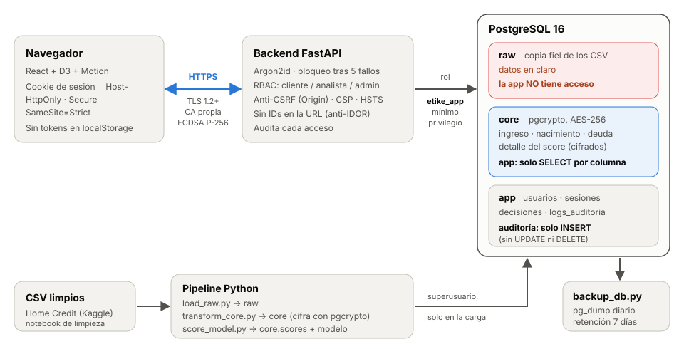

# CrediFácil: Tu score, sin cajas negras

**Proyecto de Ética y Seguridad de Datos — DS3031 · Informe escrito**

**Equipo:** Jyns Arturo Ordóñez del Carpio · Joaquin Salazar

**[Abrir la demo del panel →](demo/)** · [Código fuente en GitHub](https://github.com/Jyns123/ETIKE)

> **Resumen.** CrediFácil es una fintech ficticia que da microcréditos a personas sin historial bancario. Maneja datos que la ley peruana considera **sensibles**, como el ingreso de cada solicitante, así que el proyecto se diseñó primero desde la ciberseguridad:
>
> - **Modelo de amenazas explícito** (STRIDE).
> - **Cifrado en reposo** con AES-256 por columna, y **backups cifrados y autenticados** con AES-256-GCM.
> - **Tránsito solo por HTTPS**: TLS 1.2+ con una CA propia.
> - **Contraseñas con Argon2id**, con bloqueo ante fuerza bruta.
> - **Control de acceso por rol y por dato**, más un rol de base de datos de mínimo privilegio que ni siquiera puede leer los datos en claro ni borrar la auditoría.
> - **Registro inalterable de cada acceso** a datos personales.
> - **Políticas, formación y un plan de respuesta** con los plazos del nuevo reglamento de la Ley 29733.
>
> Los controles se verifican con 51 pruebas automatizadas, varias de ellas ataques reales contra la aplicación. Sobre esa base, el score es transparente: cada punto se explica, y no tener historial no penaliza.

---

## Tabla de contenidos

1. [Contexto y caso de negocio](#1-contexto-y-caso-de-negocio)
2. [Marco normativo y estándares](#2-marco-normativo-y-estándares)
3. [Requerimientos](#3-requerimientos)
4. [Modelo de amenazas](#4-modelo-de-amenazas)
5. [Arquitectura y diseño de seguridad](#5-arquitectura-y-diseño-de-seguridad)
6. [Controles implementados](#6-controles-implementados)
7. [Pruebas y evidencias de seguridad](#7-pruebas-y-evidencias-de-seguridad)
8. [Uso seguro de los datos: políticas, procedimientos y formación](#8-uso-seguro-de-los-datos-políticas-procedimientos-y-formación)
9. [Plan de respuesta a incidentes](#9-plan-de-respuesta-a-incidentes)
10. [Riesgos residuales y recomendaciones futuras](#10-riesgos-residuales-y-recomendaciones-futuras)
11. [Implementación del sistema](#11-implementación-del-sistema)
12. [Planificación y ejecución](#12-planificación-y-ejecución)
13. [Lecciones aprendidas y retrospectiva](#13-lecciones-aprendidas-y-retrospectiva)
14. [Fuentes](#14-fuentes)

---

## 1. Contexto y caso de negocio

### 1.1 El problema

Los bancos tradicionales en el Perú rechazan crédito a quien no tiene historial bancario formal. En 2024 el **70,9%** de los trabajadores del país tenía un empleo informal (INEI) y **más de 11 millones de adultos** seguían fuera del sistema financiero (SBS/BCRP con la ENAHO 2024). El scoring tradicional depende justo de los datos que esa población no tiene.

**CrediFácil** evalúa al solicitante con datos que sí puede aportar (ingreso, empleo, antigüedad, historial en otras entidades si lo tiene). Para hacerlo tiene que guardar y procesar información financiera de cientos de miles de personas. El proyecto responde dos preguntas a la vez:

- **Seguridad**: ¿cómo se protege esa información (ingresos, deudas, historial), que es un blanco atractivo, mientras se usa para decidir?
- **Ética**: ¿cómo se decide sin reproducir la exclusión que se quiere resolver, y de forma que el cliente entienda por qué?

### 1.2 Dataset base

[Home Credit Default Risk](https://www.kaggle.com/c/home-credit-default-risk/data) (Kaggle): 307,511 solicitudes reales con la variable objetivo (`TARGET`: atrasos en las primeras cuotas) y 121 variables, más `bureau.csv` (1,716,428 créditos en otras entidades). Tras la limpieza (`notebooks/limpieza_datos.ipynb`) quedan 307,507 solicitudes; el 8,07% tuvo atrasos y el **14,3% no tiene historial en el bureau**, que es el segmento "informal" que el negocio quiere incluir.

### 1.3 Datos complementarios: contexto del Perú

Home Credit no es un dataset peruano, así que se agregó un conjunto de indicadores públicos para dimensionar el mercado y fijar metas realistas: [`dataset/complementarios/contexto_peru.csv`](https://github.com/Jyns123/ETIKE/blob/main/dataset/complementarios/contexto_peru.csv), con fuente, periodo y URL por fila.

| Indicador | Valor | Periodo | Fuente | Para qué lo usamos |
|---|---|---|---|---|
| Empleo informal | 70,9% de los ocupados | 2024 | INEI (EPEN) | Tamaño del segmento objetivo |
| Empleo informal urbano / rural | 65,6% / 94,3% | jul-2023 a jun-2024 | INEI (EPEN) | El canal digital llega primero a la zona urbana |
| Adultos con cuenta en el sistema financiero | 57% | 2024 | ENAHO 2024 (SBS/BCRP) | Brecha de acceso |
| Adultos con cuenta o billetera digital | 67% | 2024 | ENAHO 2024 (SBS/BCRP) | Brecha incluso contando Yape/Plin |
| Adultos fuera del sistema financiero | más de 11 millones | 2024 | SBS/BCRP | Mercado potencial |
| Deudores del sistema financiero | 8 248 431 | dic-2024 | SBS | Personas que ya tienen historial |
| Morosidad de entidades especializadas en MYPE | 6,2% (a 90 días: 4,7%) | dic-2024 | SBS | Referencia para la meta de atrasos |
| Tasa de interés promedio a microempresas (MN) | 58,01% anual | dic-2024 | SBS | Costo actual del crédito para el segmento |

El mercado que hoy atiende a este segmento convive con una morosidad del 4,7% al 6,2%. Una meta de atrasos por debajo de ~10% entre aprobados es realista. La salvedad es que el `TARGET` de Home Credit no se define igual que la morosidad contable de la SBS, así que sirve como orden de magnitud y no como comparación exacta.

### 1.4 Objetivos y resultados clave (OKRs)

| Objetivo | Resultado clave | Meta | Resultado medido |
|---|---|---|---|
| **O1. Proteger los datos de los clientes** | Columnas sensibles en claro en el schema que usa la app | 0 | **0** (100% de las filas en AES-256, verificado por prueba) |
| | Backups cifrados y autenticados | 100% | 100% (AES-256-GCM, sección 6.7) |
| | Accesos a datos personales auditados | 100% | 100% (cada endpoint registra, sección 6.6) |
| | Controles de seguridad con prueba automatizada | Todos los de la sección 3.2 | 51 pruebas, 51 de 51 pasan |
| | Recuperación ante desastre | RPO ≤ 24 h, RTO ≤ 1 h | Backup en 35 s; restauración completa y verificada en **16 s** |
| **O2. Incluir a quien el sistema tradicional deja fuera** | Aprobación de solicitantes sin historial | ≥ modelo tradicional + 2 pp | 67,3% vs 64,3% (**+3,0 pp**) |
| **O3. Riesgo sostenible** | Atrasos entre aprobados | ≤ 10% (SBS MYPE: 4,7–6,2%) | **5,0%** (población: 8,07%) |
| | AUC sin variables sensibles | ≥ 0,72, costo ≤ 0,02 | 0,725 vs 0,739 (costo 0,014) |
| **O4. Decisión inmediata y explicable** | Tiempo de respuesta del score explicado | < 1 s (la banca tradicional tarda días) | 35 ms de mediana (p95: 46 ms) |

---

## 2. Marco normativo y estándares

### 2.1 Ley N.º 29733 y su nuevo reglamento

El Perú regula el tratamiento de datos personales con la **Ley N.º 29733, Ley de Protección de Datos Personales**. Su reglamento vigente es el **D.S. N.º 016-2024-JUS**, publicado el 30 de noviembre de 2024 y en vigor desde el 30 de marzo de 2025. Lo que condiciona el diseño de seguridad:

- **El ingreso es un dato sensible.** El artículo 2 (numeral 5) incluye los *ingresos económicos* entre los datos sensibles, junto con los de salud y los biométricos. Su tratamiento exige consentimiento **por escrito** y un nivel de protección mayor. Por eso el ingreso va cifrado, solo lo descifra su titular y ningún analista puede verlo.
- **Principio de seguridad**: el responsable debe aplicar medidas técnicas y organizativas proporcionales al riesgo (cifrado, control de acceso, auditoría, formación).
- **Finalidad y proporcionalidad**: los datos se usan solo para calcular y explicar el score. La fecha de nacimiento se guarda cifrada y la aplicación **nunca la descifra**, porque el modelo no usa la edad.
- **Derechos ARCO** (Acceso, Rectificación, Cancelación, Oposición): el panel implementa el derecho de acceso: el cliente ve sus datos tal como están guardados y quién accedió a ellos.
- **Notificación de incidentes**: con el nuevo reglamento, un incidente que exponga grandes volúmenes de datos, datos sensibles o que afecte a muchas personas se notifica a la **Autoridad Nacional de Protección de Datos Personales en un máximo de 48 horas** desde que se conoce, y si ocurre en el entorno digital también al **Centro Nacional de Seguridad Digital** (sección 9).

### 2.2 Estándares de referencia

No buscamos una certificación, pero usamos estándares internacionales como lista de verificación de los controles:

| Control del proyecto | ISO/IEC 27001:2022, Anexo A | Otras referencias |
|---|---|---|
| Clasificación de la información (5.2) | 5.12 Clasificación de la información | Ley 29733, art. 2 |
| RBAC, anti-IDOR y mínimo privilegio en app y BD (6.4) | 5.15 Control de acceso · 8.2 Derechos de acceso privilegiado · 8.3 Restricción de acceso a la información | OWASP Top 10: A01 Broken Access Control |
| Argon2id, bloqueo, sesiones (6.3) | 8.5 Autenticación segura · 5.17 Información de autenticación | OWASP A07, Password Storage Cheat Sheet, RFC 9106 |
| Cifrado en reposo, en tránsito y de backups; gestión de llaves (5.4, 5.5) | 8.24 Uso de criptografía | OWASP A02 Cryptographic Failures |
| Pseudonimización con HMAC (6.4) | 8.11 Enmascaramiento de datos | |
| Cabeceras, CSP, CSRF, consultas parametrizadas (6.5) | 8.26 Requisitos de seguridad de las aplicaciones · 8.28 Codificación segura | OWASP A03 Injection, A05 Security Misconfiguration |
| Auditoría de solo inserción (6.6) | 8.15 Registro de eventos · 8.16 Monitoreo | OWASP A09 Logging and Monitoring Failures |
| Backup cifrado y restauración probada (6.7) | 8.13 Copias de seguridad de la información | |
| Pruebas de seguridad (7) | 8.29 Pruebas de seguridad en desarrollo y aceptación | |
| Plan de respuesta a incidentes (9) | 5.24 a 5.28 Gestión de incidentes | NIST SP 800-61 |
| Concientización y formación (8) | 6.3 Concienciación, educación y formación | |
| Privacidad por diseño | 5.34 Privacidad y protección de datos personales | Ley 29733 y D.S. 016-2024-JUS |

### 2.3 Trasfondo ético: scoring alternativo y discriminación por proxy

El *alt-data scoring* reemplaza el historial crediticio por datos que la población no bancarizada sí tiene. Su riesgo es la **discriminación por proxy**: variables que, sin ser un atributo protegido, están tan correlacionadas con él que producen el mismo efecto (por ejemplo, un score externo con correlación 0,60 con la edad). Por eso el modelo del proyecto es un **scorecard**: cada factor se divide en tramos con puntos fijos, el score es la suma, y se excluyen explícitamente los atributos protegidos y sus proxies (sección 11.2).

---

## 3. Requerimientos

### 3.1 Requerimientos funcionales

| Rol | Qué puede hacer |
|---|---|
| **Cliente** | Ver su score y cómo se calculó, simular cambios, ver un plan para ser apto, compararse de forma anónima, ver sus datos cifrados y quién accedió a ellos |
| **Analista** | Ver indicadores agregados y aprobar o rechazar solicitudes viendo solo score y alias, nunca el dato identificable ni descifrado |
| **Admin** | Lo del analista más el registro completo de auditoría |

| ID | Requerimiento | Dónde se implementa |
|---|---|---|
| RF-01 | Iniciar y cerrar sesión; la sesión expira sola por inactividad | `routers/auth.py`, `Topbar.tsx` |
| RF-02 | Ver score, banda, percentil y tasa de atraso de su grupo | `/api/mi/score`, `Hero.tsx` |
| RF-03 | Ver de dónde sale cada punto (cascada, tabla y tramos de cada factor) | `Desglose.tsx`, `FactorDrawer.tsx` |
| RF-04 | Sugerencias personalizadas, plan mínimo para ser apto y simulador | `scoring.py`, `lib/scorecard.ts`, `Mejora.tsx` |
| RF-05 | Compararse con otros sin exponer a nadie (alias, score redondeado, ingreso cifrado) | `/api/comunidad`, `Comunidad.tsx` |
| RF-06 | Conocer las variables que el modelo no usa y el costo de esa decisión | `Etica.tsx` |
| RF-07 | Ver sus datos cifrados, descifrar su ingreso bajo demanda y ver el historial de accesos | `/api/mi/datos`, `/api/mi/actividad`, `MisDatos.tsx` |
| RF-08 | Panel interno con indicadores agregados y de seguridad de las últimas 24 h | `/api/interno/resumen`, `Interno.tsx` |
| RF-09 | Aprobar o rechazar solicitudes sin ver identificadores reales | `/api/interno/solicitudes`, `app.decisiones` |
| RF-10 | Registro de auditoría consultable por el admin | `/api/interno/auditoria` |
| RF-11 | Pipeline reproducible de los CSV a la base, con un comando | `pipeline/run_pipeline.py` |
| RF-12 | Backup diario cifrado, verificación y restauración | `pipeline/backup_db.py` |

### 3.2 Requerimientos de seguridad

| ID | Requerimiento | Control (sección) |
|---|---|---|
| RS-01 | Datos sensibles cifrados en reposo | pgcrypto AES-256 por columna (6.2) |
| RS-02 | Backups cifrados y con integridad verificable | AES-256-GCM al vuelo, restore que verifica antes de escribir (6.7) |
| RS-03 | Todo el tráfico cifrado y autenticado | Solo HTTPS, TLS 1.2+, CA propia, HSTS (6.1) |
| RS-04 | Contraseñas nunca recuperables | Argon2id con sal por cuenta (6.3) |
| RS-05 | Resistencia a fuerza bruta y enumeración de usuarios | Bloqueo tras 5 fallos, límite por IP, mensaje y tiempo iguales (6.3) |
| RS-06 | Sesiones que no se puedan robar ni reutilizar | Cookie `__Host-` HttpOnly/Secure/SameSite=Strict, token de 256 bits, solo su hash en BD, expiración (6.3) |
| RS-07 | Cada usuario accede solo a lo que su rol y su identidad permiten | RBAC por endpoint, sin IDs en la URL (6.4) |
| RS-08 | Mínimo privilegio en la base de datos | Rol `etike_app`: sin `raw`, SELECT por columna, auditoría solo INSERT (6.4) |
| RS-09 | Todo acceso a datos personales queda registrado y no se puede borrar | `app.logs_auditoria` de solo inserción (6.6) |
| RS-10 | Otros clientes nunca identificables | Alias HMAC-SHA256, score redondeado, ingreso cifrado (6.4) |
| RS-11 | Protección de la aplicación web | CSP, anti-CSRF, anti-clickjacking, consultas parametrizadas, errores sin datos (6.5) |
| RS-12 | Secretos fuera del código y de los logs | `.env` fuera de git, llaves separadas por uso, logs del rol silenciados (5.5) |
| RS-13 | Minimización: no descifrar lo que no se usa | La fecha de nacimiento nunca se descifra (6.2) |
| RS-14 | Continuidad: RPO ≤ 24 h, RTO ≤ 1 h | Backup diario con restauración probada (6.7) |

---

## 4. Modelo de amenazas

### 4.1 Activos

| Activo | Clasificación (5.2) | Por qué es valioso para un atacante |
|---|---|---|
| Ingreso, fecha de nacimiento, deuda externa, detalle del score | Sensible | Datos financieros personales: fraude, extorsión, venta. El ingreso es dato sensible por ley |
| Credenciales (hashes) y sesiones | Sensible | Permiten suplantar a clientes o al personal |
| Llaves (pgcrypto, pseudonimización, backups, TLS) | Secreto | Con la llave, todo lo cifrado queda expuesto |
| Registro de auditoría | Confidencial | Borrarlo o alterarlo oculta un ataque |
| Backups | Sensible | Copia completa de la base, incluido el schema `raw` en claro |
| Decisiones de crédito | Interno | Manipularlas da crédito a quien no corresponde |

### 4.2 Actores de amenaza

- **Atacante externo** en internet: fuerza bruta, robo de sesión, inyección, CSRF, interceptación del tráfico.
- **Cliente malicioso autenticado**: intenta ver los datos de otro cliente (IDOR) o subir sus privilegios.
- **Empleado curioso o malicioso** (analista): intenta ver ingresos o identidades que no necesita.
- **Atacante con acceso al servidor o a una copia** de la base o del backup (equipo robado, backup expuesto).
- **Error humano**: una llave subida al repositorio, un log que guarda datos.

### 4.3 Análisis STRIDE

| Amenaza | Escenario en CrediFácil | Controles | Evidencia |
|---|---|---|---|
| **S**uplantación | Adivinar contraseñas, reutilizar una sesión robada | Argon2id, bloqueo tras 5 fallos, límite de 10 intentos / 5 min por IP, mensaje único; cookie HttpOnly + Secure + SameSite=Strict, token de 256 bits, expiración 30 min / 8 h | Pruebas 7.1: bloqueo, límite por IP, no enumeración |
| **T**ampering (manipulación) | Alterar datos cifrados, el backup, la auditoría o una petición | MDC de OpenPGP en cada columna; AES-256-GCM en backups; auditoría sin UPDATE/DELETE; TLS; anti-CSRF | Pruebas de backup alterado y de auditoría inalterable |
| **R**epudio | "Yo no vi esos datos" | Cada acceso, descifrado, decisión e intento fallido queda registrado con usuario, IP y resultado | Prueba de descifrado denegado y auditado |
| **I**nformation disclosure (fuga) | Robo de la base, del backup o del tráfico; analista curioso; IDOR; errores verbosos | Cifrado por columna, backup cifrado, TLS, mínimo privilegio, sin IDs en la URL, alias HMAC, errores sin reflejar datos, llave fuera de los logs | Pruebas de IDOR, de permisos del rol y de AES-256 |
| **D**enegación de servicio | Inundar el login | Límite de intentos por IP | Prueba 429. Riesgo residual: sin WAF (10) |
| **E**levación de privilegios | Cliente que llama al panel interno; inyección SQL; aplicación comprometida | RBAC por endpoint; consultas siempre parametrizadas; rol de BD sin acceso a `raw`, sin DDL, sin borrar auditoría | Pruebas de RBAC y de permisos del rol |

### 4.4 Superficie de ataque

Solo un puerto expuesto (HTTPS 8443). La documentación interactiva de la API está apagada por defecto. El servidor no anuncia su versión (`server_header=False`). Las rutas de archivos estáticos están protegidas contra *path traversal*. La base de datos no se expone a la web: solo la ve el backend, con un rol limitado.

---

## 5. Arquitectura y diseño de seguridad

### 5.1 Arquitectura y defensa en profundidad



Ningún control es el único que protege un dato. Si una capa falla, la siguiente sigue en pie:

| Capa | Controles |
|---|---|
| **Red y transporte** | Solo HTTPS (TLS 1.2+), certificado de CA propia, HSTS; un solo puerto expuesto |
| **Aplicación** | Autenticación con Argon2id y bloqueo, sesiones seguras, RBAC, anti-IDOR, anti-CSRF, CSP estricta, validación de entradas, consultas parametrizadas |
| **Datos** | Cifrado AES-256 por columna, rol de BD de mínimo privilegio, auditoría de solo inserción, pseudonimización |
| **Operación** | Backups cifrados y verificados, llaves separadas y fuera del código, políticas, formación y plan de respuesta a incidentes |

La base tiene tres schemas con responsabilidades separadas: **`raw`** (copia fiel de los CSV, en claro; la app no tiene acceso), **`core`** (datos con las columnas sensibles cifradas, el modelo y los scores) y **`app`** (usuarios, sesiones, auditoría y decisiones). El pipeline usa el superusuario solo para cargar; la web usa siempre el rol `etike_app`.

### 5.2 Clasificación de los datos

| Nivel | Ejemplos | Controles |
|---|---|---|
| **Público** | Definición del modelo (tramos, puntos, variables excluidas), métricas agregadas | Se muestra a cualquier cliente autenticado (transparencia) |
| **Interno** | Score y banda por alias, decisiones de aprobación | Solo personal con RBAC; alias en vez de ID |
| **Confidencial** | Montos del crédito, historial en bureau, IP en la auditoría | Sin acceso desde la app a `raw`; acceso por columna |
| **Sensible** | Ingreso, fecha de nacimiento, detalle del score, contraseñas | Cifrado AES-256 o hash Argon2id; descifrado solo para el titular; auditado |

### 5.3 Diseño criptográfico

| Uso | Algoritmo / protocolo | Parámetros | Por qué |
|---|---|---|---|
| Columnas sensibles (ingreso, nacimiento, deuda, detalle del score) | OpenPGP simétrico (RFC 4880) vía `pgcrypto`, **AES-256** | Llave derivada con S2K iterado y con una sal aleatoria nueva por valor (más el prefijo aleatorio del formato OpenPGP); código de detección de modificaciones (MDC) activo | Dos ingresos iguales producen cifrados distintos (no se pueden comparar filas) y una manipulación se detecta al descifrar. El algoritmo se lee en el 4º byte (`09` = AES-256), así que se puede verificar |
| Backups | **AES-256-GCM** (cifrado autenticado) | Llave aleatoria de 256 bits; nonce aleatorio de 96 bits por archivo; tag de 128 bits; la cabecera va como dato asociado | Confidencialidad e integridad: un backup alterado o una llave equivocada se detectan antes de restaurar |
| Contraseñas | **Argon2id** | t = 3, m = 64 MiB, p = 4, sal de 16 bytes, hash de 32 bytes (perfil de RFC 9106); re-hash automático si cambian | Función *memory-hard*: cada intento cuesta 64 MiB de memoria, lo que encarece los ataques con GPU/ASIC |
| Transporte | **TLS 1.2 y 1.3** | Solo suites ECDHE con AES-GCM o ChaCha20-Poly1305 (secreto perfecto hacia adelante); certificado ECDSA P-256 / SHA-256 | Cifrado y autenticación del servidor; una llave de sesión robada no descifra tráfico pasado |
| Certificados | **CA propia** | CA: 10 años, `pathLen=0`, solo firma certificados. Servidor: 397 días, SAN `localhost`/`127.0.0.1`/`::1`, uso `serverAuth` | Cumple el requisito de certificados de CA propia con restricciones como las de una CA real |
| Sesiones | Token aleatorio de 256 bits (CSPRNG) | En la BD solo su **SHA-256** | Un volcado de la tabla de sesiones no sirve para entrar |
| Pseudónimos | **HMAC-SHA256** con llave del servidor | Alias `CF-XXXX-XXXX` a partir del HMAC del ID | Estable (el mismo cliente, el mismo alias) e irreversible sin la llave, aunque se conozca el algoritmo y el rango de IDs |

### 5.4 Gestión de llaves y secretos

| Secreto | Protege | Dónde vive | Rotación |
|---|---|---|---|
| `HC_ENCRYPTION_KEY` | Columnas cifradas con pgcrypto | `pipeline/.env` y `web/backend/.env` (fuera de git) | Procedimiento de re-cifrado (sección 8.2) |
| `BACKUP_KEY` | Backups | `pipeline/.env` **y una copia fuera del servidor** | Llave nueva para backups nuevos; la anterior se conserva hasta que expiren sus backups (7 días) |
| `PSEUDONYM_KEY` | Alias de los clientes | `web/backend/.env` | Rotarla cambia todos los alias |
| `APP_DB_PASSWORD` | Acceso del rol `etike_app` | `web/backend/.env`, generada al azar | `ALTER ROLE` + reinicio de la app |
| `ca.key`, `server.key` | Identidad TLS | `web/certs/` (fuera de git) | Servidor cada 397 días; CA cada 10 años |
| Contraseñas de usuarios | Cuentas | Solo como hash Argon2id | Las elige el usuario; re-hash automático |

Reglas: **una llave por propósito** (si se filtra una, las demás siguen protegiendo lo suyo); ninguna llave en el código ni en el repositorio; los scripts de configuración generan las llaves con un generador criptográfico. La llave de pgcrypto viaja en el texto de las consultas, así que el rol de la app y el script de migración tienen `log_min_error_statement = panic` y `log_statement = none`: Postgres nunca la escribe en su log.

---

## 6. Controles implementados

### 6.1 Seguridad en tránsito

- La aplicación **solo** escucha por HTTPS (`run.py`); no hay puerto HTTP.
- TLS 1.2 como mínimo, suites `ECDHE+AESGCM:ECDHE+CHACHA20` y certificado firmado por la CA propia del proyecto (`scripts/gen_certs.py`).
- **HSTS** (`max-age` de un año): el navegador se niega a volver a usar HTTP con el sitio.
- La cookie de sesión tiene prefijo `__Host-` y atributo `Secure`: nunca viaja por HTTP ni a otro dominio.

### 6.2 Seguridad en reposo

- Ingreso, fecha de nacimiento, deuda externa y el detalle del score se cifran con `pgp_sym_encrypt(..., 'cipher-algo=aes256')`. Ni un `SELECT *` directo a la base muestra nada en claro sin la llave.
- `pgp_sym_encrypt` usa AES-128 si no se le indica otra cosa. Se forzó AES-256 en todo el pipeline y se escribió una migración (`pipeline/migrar_aes256.py`) para re-cifrar las bases cargadas antes: idempotente, en una transacción, y el texto en claro nunca sale de Postgres.
- **Minimización**: la fecha de nacimiento se guarda cifrada y la app nunca la descifra; si alguien lo intenta, se niega y queda auditado.
- Contraseñas: solo el hash Argon2id; sesiones: solo el SHA-256 del token.

### 6.3 Autenticación y sesiones

| Ataque | Control |
|---|---|
| Fuerza bruta a una cuenta | Bloqueo de 15 min tras 5 intentos fallidos |
| Fuerza bruta distribuida entre cuentas | Máximo 10 intentos cada 5 min por IP (responde 429 con `Retry-After`) |
| Enumeración de usuarios | Mismo mensaje para usuario inexistente, contraseña incorrecta o cuenta bloqueada; si el usuario no existe se verifica igual contra un hash de relleno para que el tiempo de respuesta no lo delate |
| Robo de sesión por XSS | Cookie `HttpOnly` (JavaScript no la puede leer); nada se guarda en `localStorage` |
| Uso de la sesión desde otro sitio | `SameSite=Strict` + verificación de `Origin` |
| Fijación y reutilización de sesión | Token nuevo en cada login; iniciar sesión invalida las anteriores; cerrar sesión la borra en el servidor |
| Sesión olvidada abierta | Expira tras 30 min sin actividad y a las 8 h en total |

### 6.4 Control de acceso

- **RBAC** con tres roles (`cliente`, `analista`, `admin`), verificado en cada endpoint (`requiere_rol`).
- **Anti-IDOR por diseño**: ningún endpoint del cliente recibe un identificador; el cliente consultado sale siempre de la sesión. Si alguien agrega un parámetro en la URL, se ignora; una prueba falla si aparece un endpoint con ID.
- **Mínimo privilegio en Postgres**: el rol `etike_app` no puede leer `raw`, solo lee 4 columnas de `core.solicitudes`, no puede leer `core.historial_bureau`, no puede modificar ni borrar la auditoría y no puede crear tablas. Si alguien compromete la aplicación, hereda esos límites.
- **Pseudonimización**: el analista y los demás clientes ven alias `CF-XXXX-XXXX`, el score redondeado a decenas y el ingreso de otros solo cifrado.

### 6.5 Seguridad de la aplicación web

| Riesgo (OWASP) | Control |
|---|---|
| Inyección SQL (A03) | Todas las consultas usan parámetros de `psycopg2`; ninguna concatena entradas del usuario |
| XSS (A03) | CSP estricta: `script-src 'self'`, sin `unsafe-inline`, sin CDNs; React escapa el contenido por defecto |
| CSRF | `SameSite=Strict` + toda petición que cambia estado debe traer un `Origin` de la lista permitida |
| Clickjacking | `X-Frame-Options: DENY` y `frame-ancestors 'none'` |
| Datos en respuestas de error | El manejador de validación quita el valor recibido: una contraseña mal formada no vuelve en la respuesta ni en los logs |
| Caché de datos personales | `Cache-Control: no-store` en toda la API |
| Otras cabeceras | `X-Content-Type-Options: nosniff`, `Referrer-Policy: no-referrer`, `Permissions-Policy`, `Cross-Origin-Opener-Policy` y `Cross-Origin-Resource-Policy` |
| Validación de entradas | Modelos Pydantic con longitudes máximas; en la BD, el nombre de usuario debe cumplir `^[a-z0-9._-]{3,40}$` |

### 6.6 Auditoría y monitoreo

Cada login (exitoso o no), bloqueo por IP, lectura de datos, descifrado (permitido o denegado), decisión de crédito y consulta de la auditoría queda en `app.logs_auditoria` con usuario, acción, recurso, cliente afectado, IP, *user agent*, resultado y fecha. El rol de la app solo puede **insertar**: ni un atacante que controle la aplicación puede borrar su rastro. El cliente ve los accesos a sus datos; el admin ve todo y el panel interno resume los logins fallidos y descifrados de las últimas 24 h, que son la primera señal del plan de respuesta (sección 9).

### 6.7 Backup cifrado y continuidad

- `pipeline/backup_db.py` genera un `pg_dump` completo y lo **cifra al vuelo con AES-256-GCM**: la salida de `pg_dump` pasa por un pipe y nunca se escribe en claro en el disco. Se cifra porque el dump incluye el schema `raw` en claro y las tablas de la app.
- La llave (`BACKUP_KEY`) es distinta de la de pgcrypto y debe guardarse también **fuera del servidor**: sin ella el backup es irrecuperable, y si vive junto al backup no protege nada. `--generar-llave` nunca pisa una llave existente, para no dejar ilegibles los backups anteriores.
- **Integridad**: `--verificar` comprueba el tag GCM sin restaurar. `--restore` hace primero una pasada completa de verificación y solo después escribe en la base, así un archivo alterado nunca llega a borrar nada.
- Retención de 7 días con purga automática; los backups no van a git.
- **RPO ≈ 24 h** con un backup diario (cron). **RTO**: **16 s** medidos al restaurar la base completa (488,5 MB cifrados) en una base nueva, incluida la verificación de integridad, con conteos idénticos a la original (sección 7.2).

---

## 7. Pruebas y evidencias de seguridad

### 7.1 Pruebas automatizadas

51 pruebas con `pytest`. Las de integración atacan a la aplicación y a la base reales por el mismo camino que una petición del navegador (middleware, routers, rol `etike_app`):

| Área | Qué se ataca o verifica | Pruebas |
|---|---|---|
| Autenticación | Bloqueo de la cuenta tras 5 fallos; 429 al superar el límite por IP; mismo mensaje para usuario inexistente o contraseña incorrecta; un error de validación no devuelve la contraseña; hash Argon2id y usuario inexistente sin excepción | `test_integracion.py`, `test_security.py` |
| Control de acceso | Sin sesión → 401; un cliente no entra al panel interno (403); un analista no ve datos de clientes ni la auditoría (403); pasar el ID de otro cliente en la URL se ignora (IDOR); las solicitudes del analista no traen el ID real; ningún endpoint de cliente tiene ID en la ruta | `test_integracion.py`, `test_idor.py`, `test_security.py` |
| Aplicación web | Petición con `Origin` ajeno o sin `Origin` → 403 (CSRF); presencia y valor de CSP, HSTS, `X-Frame-Options`, `nosniff`, `Referrer-Policy` y `no-store` | `test_integracion.py` |
| Base de datos | El rol de la app **no puede** leer `raw`, leer una columna no concedida, leer el historial de bureau, modificar o borrar la auditoría, ni crear tablas; las columnas sensibles están todas en AES-256; intentar descifrar la fecha de nacimiento se niega y queda auditado | `test_integracion.py` |
| Backups | Ida y vuelta en varios bloques; el archivo no contiene texto en claro; se detecta un byte alterado en los datos o en la cabecera; se rechaza otra llave y un dump sin cifrar; cada backup usa un nonce distinto | `pipeline/tests/test_backup.py` |
| Modelo | Score en rango, neutralidad ante ausencia de historial, score = base + suma de puntos, bandas sin huecos | `pipeline/tests/test_score_model.py`, `test_scoring.py` |

Resultado al cerrar este informe: **51 de 51 pasan**.

### 7.2 Verificación manual contra el servidor y la base

Hecha con la aplicación corriendo en local (`python run.py`), `openssl s_client` 3.5, `curl` y una conexión directa a Postgres con el rol de la aplicación.

**Transporte (TLS)**

| Prueba | Resultado |
|---|---|
| Cliente que solo ofrece TLS 1.0 o TLS 1.1 (con el nivel de seguridad del cliente en 0, para que sí los ofrezca) | El servidor corta el *handshake*: no se establece sesión |
| TLS 1.2 | Negocia `ECDHE-ECDSA-AES256-GCM-SHA384` |
| TLS 1.3 | Negocia `TLS_AES_256_GCM_SHA384` |
| TLS 1.2 ofreciendo solo suites sin secreto perfecto hacia adelante (`AES256-SHA`, `AES128-SHA`) | Rechazado |
| Certificado | `CN=localhost` emitido por `CrediFacil Dev Root CA`; llave ECDSA P-256 firmada con SHA-256; SAN `localhost`, `127.0.0.1`, `::1`; uso `TLS Web Server Authentication`; verificación **OK** contra la CA propia |
| Petición HTTP sin TLS al mismo puerto | Sin respuesta: el puerto solo habla TLS |

**Cabeceras de la respuesta** (`curl -D - https://localhost:8443/`). No aparece la cabecera `server`: el servidor no anuncia qué software usa.

```text
strict-transport-security: max-age=31536000
content-security-policy: default-src 'self'; script-src 'self'; style-src 'self'; img-src 'self' data:;
  font-src 'self'; connect-src 'self'; object-src 'none'; base-uri 'none'; form-action 'self'; frame-ancestors 'none'
x-content-type-options: nosniff
x-frame-options: DENY
referrer-policy: no-referrer
permissions-policy: camera=(), microphone=(), geolocation=(), payment=()
cross-origin-opener-policy: same-origin
cross-origin-resource-policy: same-origin
```

**Ataques a la aplicación**

| Intento | Respuesta |
|---|---|
| Pedir el score sin sesión | `401 {"detail":"Sesión no iniciada"}` con `Cache-Control: no-store` |
| Cerrar la sesión de otro desde un sitio ajeno (`Origin: https://sitio-malicioso.example`) | `403 {"detail":"Origen no permitido"}` |
| Abrir la documentación interactiva de la API (`/api/docs`) | `404`: apagada fuera de desarrollo |
| *Path traversal* hacia el `.env` (`/../../backend/.env`) | Devuelve la página de la aplicación, nunca el archivo |

**Mínimo privilegio en la base**: conectado como `etike_app` (sin superusuario, sin `CREATEDB`, sin `CREATEROLE`):

```text
SELECT * FROM raw.application_train_clean       -> ERROR 42501: permiso denegado al esquema raw
SELECT target, monto_credito FROM core.solicitudes -> ERROR 42501: permiso denegado a la tabla solicitudes
UPDATE app.logs_auditoria SET exito = true       -> ERROR 42501: permiso denegado a la tabla logs_auditoria
DELETE FROM app.logs_auditoria                   -> ERROR 42501: permiso denegado a la tabla logs_auditoria
DROP TABLE app.logs_auditoria                    -> ERROR: debe ser dueño de la tabla logs_auditoria
```

**Cifrado en reposo**: el 4º byte de cada valor cifrado indica el algoritmo (`07` = AES-128, `09` = AES-256). Antes de la migración, la base de desarrollo tenía el ingreso, la fecha de nacimiento y la deuda en AES-128. `migrar_aes256.py` los re-cifró dentro de Postgres, en una sola transacción:

```text
core.solicitudes.ingreso_cifrado:           307,507 filas re-cifradas (194 s)
core.solicitudes.fecha_nacimiento_cifrada:  307,507 filas re-cifradas (194 s)
core.scores.detalle_cifrado:                      0 filas re-cifradas (ya estaba en AES-256)
core.historial_bureau.monto_deuda_cifrado: 1,242,203 filas re-cifradas (771 s)
```

Después, la prueba `test_columnas_sensibles_cifradas_con_aes256` confirma que no queda **ninguna** fila fuera de AES-256.

**Backup cifrado, de punta a punta** (base completa: 307,507 solicitudes, 1,465,291 registros de bureau más el schema `raw`):

| Paso | Resultado |
|---|---|
| `backup_db.py` | `homecredit_2026-09-24_2311.dump.enc`, 488,5 MB, generado y cifrado en **35 s** |
| ¿Se ve la firma de un dump en claro (`PGDMP`) en el archivo? | No: el archivo es solo texto cifrado |
| `--verificar` sobre el original | Integridad OK en 0,5 s |
| Copia con **un solo bit** cambiado | Rechazada: `fue modificado o la llave no es la correcta (tag GCM inválido)` |
| Original con otra llave | Rechazado con el mismo mensaje |
| `--restore` en una base nueva | **16 s** incluida la verificación previa |
| Conteos de la base restaurada vs. la original | Idénticos en las 8 comprobaciones: `raw.application_train_clean`, `raw.bureau_clean`, `core.solicitudes`, `core.historial_bureau`, `core.scores`, `app.usuarios`, `app.logs_auditoria` y filas en AES-256 |

Además, un backup que falla a mitad de camino (se probó sin `pg_dump` disponible) no deja ningún archivo parcial en `backups/`.

---

## 8. Uso seguro de los datos: políticas, procedimientos y formación

Los controles técnicos no bastan si el equipo no sabe qué datos maneja ni qué hacer con ellos.

### 8.1 Políticas

| Política | Qué establece | Cómo se hace cumplir |
|---|---|---|
| **P1. Clasificación de la información** | Cuatro niveles (5.2); cada dato tiene uno asignado | Diccionario de datos + controles por nivel |
| **P2. Mínimo privilegio y necesidad de saber** | Cada rol accede solo a lo que necesita; un analista decide con score y banda, nunca con el ingreso | **Técnico**: RBAC + permisos por columna |
| **P3. Descifrado bajo demanda** | Ningún dato sensible se descifra "por si acaso"; solo cuando su titular lo pide, y queda auditado | **Técnico**: endpoint de descifrado + auditoría |
| **P4. Gestión de llaves** | Una llave por propósito; nunca en el repositorio ni en logs; copia de la llave de backups fuera del servidor; rotación anual o inmediata ante sospecha | **Técnico**: `.env` fuera de git, logs silenciados. Rotación: procedimiento |
| **P5. Retención y eliminación** | Los datos se guardan solo mientras cumplen su finalidad (Ley 29733). Propuesta: anonimizar solicitudes rechazadas a los 12 meses; auditoría 2 años; backups 7 días | Backups: automático. Resto: procedimiento |
| **P6. Uso aceptable** | Prohibido exportar datos fuera del sistema, compartir credenciales o usar datos reales en desarrollo o demos | Contrato de confidencialidad; la demo pública usa solo cuentas de ejemplo |
| **P7. Desarrollo seguro** | Secretos fuera del código, revisión de cambios antes de integrar, pruebas de seguridad en cada cambio | Suite de pruebas de la sección 7 |

### 8.2 Procedimientos

1. **Alta y baja de personal**: las cuentas internas las crea solo el admin, con el rol mínimo necesario; se desactivan el mismo día de la salida, y cada trimestre se revisa que no queden cuentas sin dueño.
2. **Rotación de la llave de cifrado**: generar la llave nueva; re-cifrar en una transacción (`pgp_sym_encrypt(pgp_sym_decrypt(col, vieja), nueva, 'cipher-algo=aes256')`, como hace `migrar_aes256.py`); actualizar los `.env`; reiniciar la app; invalidar sesiones; registrar quién y cuándo.
3. **Backups**: diario y automático; verificación semanal con `--verificar`; **prueba de restauración mensual** en una base aparte, comparando conteos de filas.
4. **Solicitudes ARCO**: el acceso ya es autoservicio en el panel; rectificación, cancelación y oposición se atienden por un canal formal, con verificación de identidad, y cada acción se registra.

### 8.3 Concientización y formación del equipo

| Actividad | Cuándo | Contenido | Cómo se mide |
|---|---|---|---|
| Inducción obligatoria | Antes de recibir una cuenta | Clasificación de datos, Ley 29733 (el ingreso es dato sensible), políticas P1–P7, cómo reportar un incidente | 100% del personal con inducción antes de tener acceso |
| Refuerzo | Trimestral, 30 min | Casos reales de fugas en el sector financiero, phishing, errores comunes (datos en correos o capturas) | Asistencia y cuestionario corto |
| Simulación de phishing | Semestral | Correo simulado al personal con acceso interno | Porcentaje que hace clic vs. porcentaje que lo reporta |
| Simulacro de incidente | Anual | Ejercicio de mesa con el plan de la sección 9 (quién hace qué en las primeras 48 h) | Tiempo hasta la contención y hasta el borrador de notificación |

La concientización también llega al **cliente**: la sección "Tus datos" le muestra cómo están guardados sus datos y quién los vio, y el login explica las medidas de seguridad.

---

## 9. Plan de respuesta a incidentes

Sigue el ciclo clásico de NIST SP 800-61 (detección, contención, recuperación y lecciones aprendidas), que la Rev. 3 de 2025 integra en las funciones del NIST CSF 2.0.

### 9.1 Roles y severidad

| Rol | Responsabilidad |
|---|---|
| Responsable del incidente (admin de turno) | Coordina, decide la contención y lleva la bitácora |
| Oficial de datos personales | Evalúa si hay datos personales o sensibles afectados y prepara las notificaciones legales |
| Soporte técnico | Aísla sistemas, rota credenciales y llaves, restaura desde backup |
| Comunicación | Redacta el aviso a los clientes afectados |

| Severidad | Ejemplo | Contención |
|---|---|---|
| Crítica | Fuga de la base, o del backup junto con su llave | Inmediata (< 1 h) |
| Alta | Cuenta interna comprometida, llave expuesta, acceso indebido sin evidencia de exfiltración | < 4 h |
| Media | Ataque de fuerza bruta bloqueado, pico de intentos fallidos | Mismo día |

### 9.2 Fases

1. **Detección**: patrones anómalos en `app.logs_auditoria`, visibles en el panel del admin (logins fallidos, bloqueos por IP, descifrados). Consultas de apoyo:
   ```sql
   -- IPs con muchos logins fallidos en la última hora
   SELECT ip, count(*) FROM app.logs_auditoria
   WHERE accion = 'LOGIN' AND NOT exito AND ts > now() - interval '1 hour'
   GROUP BY ip HAVING count(*) >= 10;

   -- alcance: quién accedió a los datos de un cliente, y cuándo
   SELECT ts, usuario, accion, recurso, ip FROM app.logs_auditoria
   WHERE sk_id_curr_objetivo = :cliente ORDER BY ts;
   ```
2. **Contención**: detener la aplicación; cambiar la contraseña de `etike_app` e invalidar todas las sesiones (`DELETE FROM app.sesiones`); si se expuso una llave, rotarla (8.2). El rol de mínimo privilegio limita lo que un atacante pudo tocar.
3. **Evaluación y notificación**: con la auditoría se reconstruye qué se accedió y de qué clientes. Si hay datos sensibles o muchos afectados: **Autoridad Nacional de Protección de Datos Personales en un máximo de 48 horas**, y **Centro Nacional de Seguridad Digital** al ser un incidente digital. Luego, aviso a los clientes afectados: qué datos, qué se hizo y qué pueden hacer.
4. **Recuperación**: `backup_db.py --verificar` y luego `--restore` del último backup íntegro; comprobar conteos de filas; reabrir con credenciales y llaves nuevas.
5. **Lecciones aprendidas** (en la semana siguiente): causa raíz, línea de tiempo, qué lo detectó o por qué no, y qué control nuevo hace falta. Alimenta la sección 10 y el refuerzo trimestral de formación.

### 9.3 Guías por escenario

| Escenario | Señal | Contención inmediata | Recuperación y cierre |
|---|---|---|---|
| Fuerza bruta o *credential stuffing* | Pico de `LOGIN` fallidos por IP; bloqueos | El límite por IP y el bloqueo de cuenta ya lo frenan; bloquear la IP en el firewall | Si hubo un login exitoso sospechoso: cerrar esa sesión y forzar cambio de contraseña |
| Cuenta interna comprometida | Accesos del personal fuera de horario o en volumen anómalo | Desactivar la cuenta y borrar sus sesiones | Revisar sus decisiones (`app.decisiones` + auditoría) y revertir las indebidas |
| Robo de un backup | Equipo perdido, acceso no autorizado a `backups/` | El archivo está cifrado con AES-256-GCM: determinar si `BACKUP_KEY` también se expuso | Si la llave se expuso: rotarla y tratarlo como fuga de datos (notificación en 48 h). Si no: registrar el incidente |
| Filtración de `HC_ENCRYPTION_KEY` | Llave en un repositorio, log o equipo robado | Rotar la llave (re-cifrado) y las contraseñas de la base | Si además hubo acceso a la base: fuga de datos sensibles, notificación en 48 h |
| Pérdida de datos o *ransomware* | Base inaccesible o alterada | Aislar el servidor | Restaurar desde el último backup verificado; las llaves no viven en el mismo lugar que los backups |

---

## 10. Riesgos residuales y recomendaciones futuras

Lo que el sistema **todavía no** cubre, con su justificación:

| Riesgo residual | Mitigación actual | Recomendación | Por qué no ahora |
|---|---|---|---|
| Los backups cifrados viven en el mismo servidor | Cifrado AES-256-GCM, llave aparte | Copia diaria fuera del sitio (regla 3-2-1) | Sin almacenamiento externo en un proyecto académico |
| La llave de pgcrypto está en `.env` y viaja en el texto SQL | Logs silenciados; llave distinta a la de backups | Gestor de llaves (KMS/HSM) o cifrar en la aplicación | Requiere infraestructura en la nube |
| La llave privada de la CA está en el mismo equipo que el servidor | Fuera de git | Guardar la CA fuera de línea y firmar solo cuando haga falta; en producción, una CA pública (Let's Encrypt) | La CA propia es un requisito del curso |
| Sin segundo factor para el personal | Argon2id, bloqueo, límite por IP | **MFA** (TOTP o WebAuthn) para analistas y admins | Alcance de tiempo |
| No hay registro del consentimiento escrito para el ingreso | Dataset histórico | Registrar el consentimiento (y su fecha) en el formulario de solicitud | Los datos ya vienen del dataset |
| El límite de intentos por IP vive en memoria | Funciona con una instancia | Almacén compartido (Redis) al escalar | Una sola instancia |
| No hay alertas automáticas | El admin revisa el panel de 24 h | Enviar la auditoría a un SIEM con alertas | Sin infraestructura de monitoreo |
| Dependencias sin escaneo automático | Versiones mínimas fijadas | `pip-audit`, `npm audit` y escaneo de secretos en CI | No se configuró CI de seguridad |
| Sin WAF ni pruebas externas | Controles de la sección 6 | WAF delante de la app y pentest anual independiente | Sin exposición pública ni presupuesto |
| Obligaciones formales ante la ANPD | Diseño alineado a la ley | Registrar el banco de datos y designar un Oficial de Datos Personales | Empresa ficticia |
| Scoring con datos descifrados en el servidor | Se descifra lo mínimo y solo para el titular | Cifrado homomórfico o enclaves seguros | Costo y complejidad frente al beneficio |

---

## 11. Implementación del sistema

### 11.1 Pipeline de datos

`pipeline/run_pipeline.py` corre tres pasos:

1. **Carga** (`load_raw.py`): los CSV limpios van tal cual al schema `raw` con `COPY`.
2. **Transformación** (`transform_core.py`): copia a `core` cifrando ingreso, fecha de nacimiento y deuda externa con AES-256.
3. **Scoring** (`score_model.py`): entrena el scorecard y guarda por cliente su score y el detalle cifrado.

Antes, el notebook de limpieza eliminó 47 columnas con 55–70% de nulos, reemplazó un valor centinela de antigüedad laboral (55 374 filas) por nulo con un indicador, acotó el ingreso al percentil 99 y construyó el indicador de historial en el bureau.

### 11.2 Scorecard transparente y decisiones éticas

Cada factor se divide en tramos, cada tramo vale puntos fijos y el score es la suma (escala 300–850; cada 50 puntos se duplica la razón buenos/malos). Es apto quien llega a **580** puntos: el primer tramo desde el cual la tasa de atraso observada baja al 10% y ya no vuelve a subir de forma relevante.

**Variables excluidas**: género y edad (atributos protegidos); estado civil e hijos (vida privada); nivel educativo (proxy socioeconómico); zona de residencia (*redlining*); círculo social (juzgaría por deudas ajenas); `EXT_SOURCE_1` (correlación 0,60 con la edad); antigüedad del documento y del registro (proxies de edad); consultas al bureau (aportaban menos de un punto); plazo implícito del crédito (relación no monótona, imposible de explicar con honestidad).

**Neutralidad ante ausencia de historial**: los cinco factores que dependen del bureau valen **0 puntos** si el cliente no tiene historial: no suman ni restan.

**Costo medido**: frente a un modelo tradicional entrenado solo para comparar, el scorecard tiene AUC **0,725** vs 0,739 y, a igual aprobación global (75,1%), aprueba al **67,3%** de los clientes sin historial contra 64,3%.

### 11.3 Aplicación web

Backend en FastAPI y frontend en React + D3 + Motion, solo por HTTPS. El panel del cliente tiene seis secciones: su score, de dónde sale, cómo mejorar (sugerencias, plan y simulador), comparación anónima, lo que el modelo no usa, y sus datos (cifrados, descifrado bajo demanda e historial de accesos). El panel interno muestra indicadores agregados y de seguridad, las solicitudes por alias para aprobar o rechazar y, solo al admin, la auditoría.

### 11.4 Demo en GitHub Pages

La aplicación real necesita su backend y su base, y GitHub Pages solo sirve archivos estáticos. Para poder probar el panel sin instalar nada se publicó una **[demo estática](demo/)**:

- Es el mismo frontend compilado en "modo demo": en vez de llamar a la API responde con **respuestas reales del backend** exportadas para las cuentas de ejemplo (`web/backend/scripts/export_demo.py`).
- En el navegador reproduce las reglas visibles del backend: roles, bloqueo tras 5 fallos, mensaje único, expiración por inactividad y auditoría de la sesión.
- **Lo que no demuestra**: la seguridad real (Argon2id, cookie HttpOnly, TLS con CA propia, pgcrypto, rol de mínimo privilegio) solo existe en la versión local. En la demo todas las cuentas usan la contraseña `demo`, y los datos de esas cuentas son públicos: provienen del dataset público de Home Credit, sin identificador real.
- La CSP que en la versión real envía el servidor va como `<meta>`, porque Pages no permite cabeceras propias. En el build normal de la app no entra nada del modo demo.

Un workflow de GitHub Actions (`.github/workflows/pages.yml`) compila la demo y este informe y los publica en cada cambio a `main`.

---

## 12. Planificación y ejecución

### 12.1 Cómo se planificó

El primer día se escribió una guía (el `README.md` del repositorio) que fijó, antes de programar, el caso de negocio, los KPIs, el mapa de variables sensibles con su tratamiento, la arquitectura, las medidas de seguridad, el backup y el plan de incidentes, además del orden de trabajo: validar el dataset, explorarlo, diseñar la base, backend, capa de seguridad, frontend e informe en paralelo.

### 12.2 Cronología (según el historial del repositorio)

| Fecha | Hito | Responsable |
|---|---|---|
| 18-sep | Repositorio y guía del proyecto: caso, KPIs, variables sensibles, arquitectura y plan de seguridad | Jyns, Joaquin |
| 19-sep | Enunciado del curso en el repo; guía ampliada | Jyns, Joaquin |
| 20-sep | EDA y limpieza, diccionario de datos, pipeline pasos 1 y 2 (`raw` y `core` cifrado) | Joaquin |
| 21-sep | Scorecard (paso 3); backend con login seguro, RBAC y auditoría; frontend del panel | Jyns |
| 22-sep | Cifrado AES-256 en el pipeline, panel del analista, backup/restore, pruebas y primer borrador del informe | Joaquin |
| 24-sep | Backups cifrados, migración a AES-256, pruebas de integración de seguridad, demo en GitHub Pages e informe final | Jyns |

### 12.3 Qué cambió respecto al plan

- **Modelo**: el plan admitía cualquier modelo (incluso un *mock*). El EDA mostró que las variables más predictivas son justo las que le faltan al segmento sin historial, y eso llevó al scorecard con neutralidad y a medir su costo.
- **Frontend**: el plan pedía un formulario y un dashboard de analista. Se priorizó un panel para el cliente que explica su score; el panel del analista llegó después sobre el mismo backend.
- **Seguridad**: dos controles se endurecieron tras revisarlos: el cifrado pasó de AES-128 (el valor por defecto) a AES-256 con migración, y el backup pasó de un dump en claro a uno cifrado y autenticado.
- **Publicación**: la web necesita backend y GitHub Pages no lo ofrece; se resolvió con la demo estática.

---

## 13. Lecciones aprendidas y retrospectiva

### 13.1 Qué funcionó y vamos a repetir

- **Seguridad por construcción, no por disciplina.** El analista no *puede* ver el ingreso (el rol de la base no tiene la columna); ningún endpoint del cliente *puede* recibir un ID; la app no *puede* borrar la auditoría. Son garantías que no dependen de que alguien se acuerde.
- **Probar los controles como un atacante.** Las pruebas de integración intentan de verdad lo prohibido (leer `raw`, borrar la auditoría, entrar al panel interno como cliente) y confirman que falla.
- **Decidir el caso, la ética y la seguridad antes de programar.** La guía del primer día hizo que el cifrado, el scorecard y el panel apunten al mismo objetivo.
- **Medir en vez de declarar.** Comparar contra un modelo tradicional convirtió "no discriminamos" en dos números defendibles.
- **Documentar el porqué en el código.** Permitió los relevos: un integrante construyó el backend y el otro, al día siguiente, le agregó el panel del analista, el backup y las pruebas sin reescribir nada.

### 13.2 Qué salió mal o costó más de lo esperado

| Problema | Qué pasó | Lección |
|---|---|---|
| Supuesto criptográfico sin verificar | El plan decía AES-256, pero `pgp_sym_encrypt` usa AES-128 por defecto. Se descubrió leyendo el 4º byte del texto cifrado, se anotó en un README y se corrigió en el código un día después; las filas ya guardadas siguieron en AES-128 hasta que se escribió una migración | Verificar los parámetros de seguridad sobre el dato real con una prueba automatizada; un hallazgo de seguridad es una tarea con responsable, no una nota; cada cambio de cifrado va con su migración |
| Un control que "funciona" pero no es seguro | El primer backup se probó de punta a punta, pero guardaba el schema `raw` en claro y sin cifrar | Revisar cada control también desde el punto de vista del atacante, no solo que funcione |
| Diferencias entre sistemas operativos | Windows abría los CSV con otra codificación; en Mac, `pg_dump` era de otra versión que el servidor | Fijar codificación y versiones; con contenedores (Docker) no habría pasado |
| Cifras copiadas a mano | El mismo KPI apareció con dos valores distintos en la documentación | Una sola fuente de verdad: leer las métricas de `core.modelo_scorecard` |
| Trabajo concentrado y commits poco descriptivos | Gran parte del trabajo en pocos días y de madrugada, con commits grandes y mensajes como "ayuda" | Ramas por tarea, *pull requests* con revisión del compañero, commits pequeños y claros |
| El informe al final | La guía decía "escribir el informe en paralelo", pero se empezó al cerrar | Abrir el informe el primer día y completarlo al terminar cada bloque |
| Dónde se publica cada entregable | Recién al publicar se vio que GitHub Pages no puede correr el backend | Definir al inicio dónde y cómo se entrega cada pieza |

### 13.3 Retrospectiva del equipo

- **División del trabajo.** Joaquin: guía inicial, análisis y limpieza de datos, diccionario, pasos 1 y 2 del pipeline, corrección a AES-256, panel del analista, primer backup, pruebas y primer borrador del informe. Jyns: scorecard, backend y frontend, backups cifrados, migración a AES-256, pruebas de integración, demo y publicación. La división por capas funcionó porque cada uno documentó lo suyo, pero dejó puntos ciegos en los bordes. El AES-128 del pipeline se detectó al construir la web, pero quedó como una nota en un README en vez de una tarea asignada: se corrigió en el código al día siguiente, y las filas ya cargadas siguieron en AES-128 hasta la migración final. El backup tampoco se revisó desde seguridad hasta el final.
- **Coordinación.** Trabajamos de forma asíncrona y por relevos sobre la misma rama. Fue rápido, pero sin revisión cruzada. En el próximo proyecto, cada cambio pasa por un *pull request* aprobado por el otro integrante, con las pruebas de seguridad corriendo en CI.
- **Uso de IA generativa.** El enunciado lo permite y lo usamos como apoyo para programar y documentar. La lección es la misma que con cualquier fuente: todo lo generado se verificó con pruebas y ejecutándolo sobre los datos reales. El caso del AES-128 muestra que una afirmación plausible no reemplaza la verificación.
- **Si tuviéramos una semana más**: copia de los backups fuera del servidor, MFA para el personal, registro del consentimiento para el ingreso, pruebas de seguridad en CI y todo empaquetado con Docker.

---

## 14. Fuentes

- Home Credit Default Risk (Kaggle): <https://www.kaggle.com/c/home-credit-default-risk/data>
- Ley N.º 29733, Ley de Protección de Datos Personales: <https://www.leyes.congreso.gob.pe/documentos/leyes/29733.pdf>
- Reglamento de la Ley N.º 29733, D.S. N.º 016-2024-JUS (LP Derecho): <https://lpderecho.pe/reglamento-ley-proteccion-datos-personales-decreto-supremo-016-2024-jus/>
- IAPP, "Se publica el nuevo reglamento de protección de datos personales en Perú": <https://iapp.org/news/a/se-publica-el-nuevo-reglamento-de-protecci-n-de-datos-personales-en-per->
- INEI, informalidad laboral 2024 (reportado por Gestión): <https://gestion.pe/economia/informalidad-en-peru-cayo-pero-en-10-ciudades-la-situacion-fue-otra-como-entenderlo-empleo-en-peru-puestos-de-trabajo-inei-mercado-laboral-noticia/>
- INEI, Encuesta Permanente de Empleo Nacional: <https://m.inei.gob.pe/media/MenuRecursivo/boletines/informe_epen_nacional.pdf>
- Inclusión financiera 2024, ENAHO/SBS/BCRP (reportado por Gan@Más): <https://revistaganamas.com.pe/mas-de-11-millones-de-adultos-aun-estan-fuera-del-sistema-financiero-pese-al-auge-de-las-billeteras-digitales/>
- SBS, Evolución del Sistema Financiero, diciembre 2024: <https://intranet2.sbs.gob.pe/estadistica/financiera/2024/Diciembre/SF-2103-di2024.PDF>
- ISO/IEC 27001:2022, Anexo A (controles de seguridad de la información).
- OWASP Top 10: <https://owasp.org/Top10/>
- OWASP Password Storage Cheat Sheet: <https://cheatsheetseries.owasp.org/cheatsheets/Password_Storage_Cheat_Sheet.html>
- NIST SP 800-61 Rev. 3: <https://csrc.nist.gov/pubs/sp/800/61/r3/final>
- RFC 9106, Argon2: <https://www.rfc-editor.org/rfc/rfc9106>
- RFC 4880, OpenPGP (formato de `pgcrypto`): <https://www.rfc-editor.org/rfc/rfc4880>
- PostgreSQL, documentación de `pgcrypto`: <https://www.postgresql.org/docs/16/pgcrypto.html>

---

*Informe del proyecto CrediFácil — DS3031, Ética y Seguridad de Datos. Código fuente, pipeline y detalles técnicos en el [repositorio de GitHub](https://github.com/Jyns123/ETIKE).*
